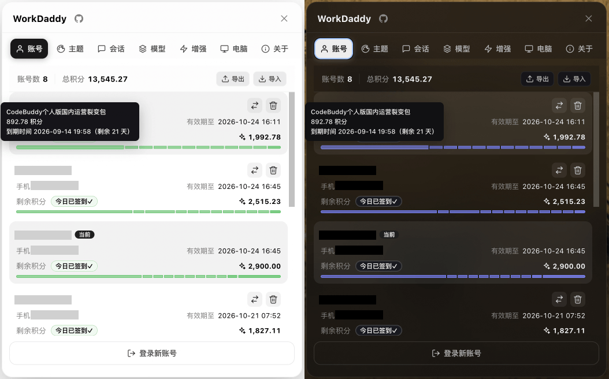
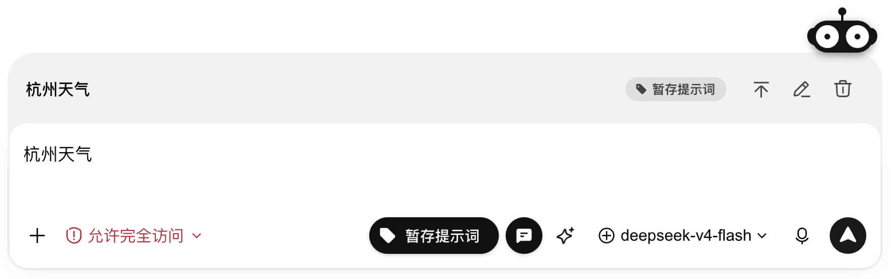
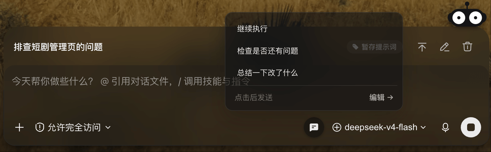
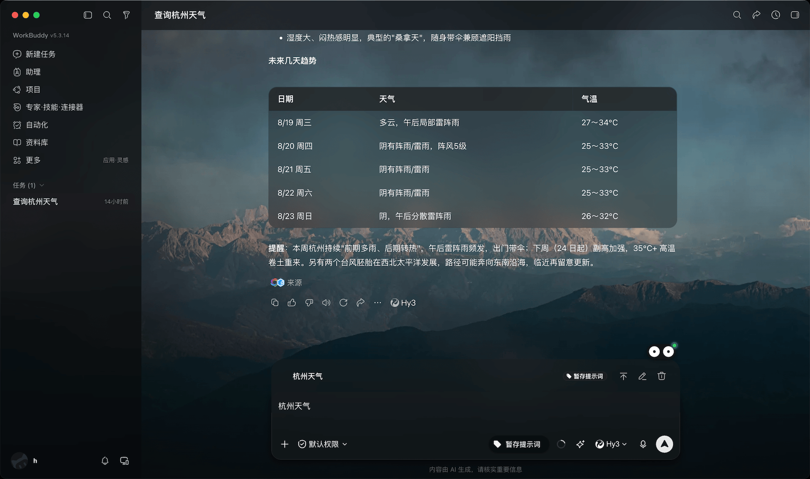

# WorkSwitch

> **WorkSwitch 是 AI 桌面客户端增强助手：一次安装，同时增强 WorkBuddy（国内版/AI）、CodeBuddy、Trae Work 等多个客户端。** 多账号独立备份、点切即用；免打扰模式让 AI 无人值守跑长任务；跨账号会话迁移、异常中断自动续接；暂存/快捷提示词；Trae 在线模型一键切换；毛玻璃主题与更多实用功能，账号与配置全部留在本机。
> 本机回环 CDP 注入 · 不改官方安装包。

一个基于 **Chrome DevTools Protocol (CDP)** 的多客户端增强工具，当前支持 [WorkBuddy](https://www.workbuddy.cn/)（国内版）、[WorkBuddy AI](https://www.workbuddy.ai/)、[CodeBuddy](https://www.codebuddy.cn/)（国内/国际）、[Trae Work CN](https://www.trae.cn/)。
零侵入、零重签名——只把界面组件注入到正在运行的客户端渲染进程里。


---

## 演示

**面板预览**


**输入框预览**



**主题效果（非最新版）**


---

## 它能做什么

- **一次安装，全端生效**：常驻管理器自动检测正在使用的客户端，为每个客户端拉起对应的扩展服务并注入面板——正常打开 WorkBuddy / Trae 即可，无需任何额外操作。
- **方便切换账号**：每个 WorkBuddy 账号独立备份，点一下就切，再也不用每次扫码。
- **无感登录新账号**：「登录新账号」支持免退出 OAuth 授权——不退出 WorkBuddy，在浏览器完成扫码后新账号自动加入列表；也可选传统的「假退出」方式回登录页扫码。
- **账号导入导出**：把全部账号备份加密导出，在另一台电脑安装 WorkSwitch 后一键导入，方便电脑之间迁移账号。
- **自动领每日积分**：打开面板即对全部账号静默签到，幂等缓存，不打断你。
- **权限弹窗免打扰**：真正的零决策弹窗弹出，可以放心开启任务后睡觉。
- **暂存提示词**：输入框边上一键把草稿「暂存」到待发送队列——图片 / 文件 / 引用原样保留，择机发送。
- **切换精美主题**：内置毛玻璃官方主题，多套预设壁纸，支持自定义壁纸（WorkBuddy 端）。
- **账号间会话迁移**：自动或手动跨账号复制会话，跨账号继续接龙。
- **模型切换更便捷**：解决 WorkBuddy 不支持添加多个同名模型的问题；**Trae 端支持在线模型列表一键切换**（含 Auto Mode），无需打开下拉框翻找。
- **Trae 会话管理**：侧栏任务列表实机同步，支持会话重命名与删除（走官方菜单入口，带双重确认）。
- **防止电脑休眠**：睡前任务未完成，开启休眠模式，任务结束后自动切换成允许休眠。
- **异常中断会话自动继续**：AI 回复因网络波动、超时等原因中断时，自动让异常中断任务继续执行。
- **快捷短语**：常用语存进面板，输入框操作栏一键点发；

### 各客户端能力矩阵

| 客户端 | 账号切换 | 会话 | 模型 | 主题 | 签到 | 暂存/增强 |
| --- | --- | --- | --- | --- | --- | --- |
| WorkBuddy 国内版 | ✓ | 管理 + 迁移 | 管理 + 切换 | ✓ | ✓ | ✓ |
| WorkBuddy AI | ✓ | 管理 + 迁移 | 管理 + 切换 | ✓ | — | ✓ |
| CodeBuddy（国内/国际） | — | 只读 | — | — | ✓ | — |
| Trae Work CN | — | 只读 + 重命名/删除 | **在线列表切换** | — | — | — |

---

## 安装

> **v0.3.0 起只需安装一个软件**：`WorkSwitch-All-Setup-x.y.z.exe` 覆盖上面表格里的全部客户端。
> 安装时会自动停止并迁移旧版分身安装（WorkSwitch / WorkSwitch AI / WorkSwitch Trae）的后台进程。

### Windows

1. 在 [Releases](../../releases) 下载最新的 `WorkSwitch-All-Setup-x.y.z.exe`
2. 双击安装器完成安装；安装完成即注册登录自启的全端管理器
3. 正常打开 WorkBuddy / Trae 等客户端（用它们自己的图标即可）——管理器会自动以调试模式重启客户端并注入面板
4. 看到机器人按钮？**搞定**。面板入口在各客户端窗口右下角

> 升级：全端版 v0.2.0+ 用户会自动更新；仍使用旧分身安装包（WorkSwitch / WorkSwitch AI）的用户，国内版会自动升级，**AI 版需手动安装一次全端版**。安装前请先退出各客户端。

### macOS

> macOS 安装包暂未随当前 Release 发布（构建脚本适配中）。可先从源码运行（见下节），或等待后续版本。

### 从源码运行（开发者）

```bash
git clone https://github.com/xiaowulai-s/Work_Switch.git
cd Work_Switch
WBSWITCH_PROFILE=workbuddy-cn bash scripts/install.sh        # 创建备份目录 + 启动守护进程
WBSWITCH_PROFILE=workbuddy-cn bash scripts/relaunch-with-cdp.sh   # 把客户端切换到调试模式并注入
```

每个客户端对应一个独立 daemon 实例，通过 profile 绑定客户端，不靠"第一个 CDP 端口"猜测目标：

```bash
WBSWITCH_PROFILE=workbuddy-cn bash scripts/relaunch-with-cdp.sh
WBSWITCH_PROFILE=workbuddy-ai bash scripts/relaunch-with-cdp.sh
WBSWITCH_PROFILE=trae-work-cn bash scripts/relaunch-with-cdp.sh   # Trae Work CN（CDP 9240）
```

Windows 上也可以用管理器替代手动流程（与安装版行为一致）：

```cmd
node scripts\supervisor.js        # 常驻管理器：检测到客户端运行时自动补齐对应服务
node scripts\supervisor.js stop   # 停止管理器（不影响已运行的服务）
```

CodeBuddy profile 的账号/模型/主题适配暂缓，当前仅提供只读会话与签到；发布包包含其能力开关，但管理器对其采取保守策略（仅在能从调试端口区分版本时接管）。

`install.sh` 做了：

- 创建 `~/Library/Application Support/WorkDaddy` 备份目录（内部目录名）
- 首次启动自动兼容迁移旧版 `~/Library/Application Support/HelloBuddy/accounts` 账号备份（旧目录保留不删除）
- 首次备份当前 WorkBuddy 账号
- 清理旧 launchd 注册并手动启动守护进程（不再登录自启）
- 立即启动后台守护进程
- 打开管理界面 `http://127.0.0.1:47832`

---

## 原理

**CDP 注入 · 不改官方安装包 · 一个管理器按需管理全部客户端**

```
┌─────────────┐  --remote-debugging-port=92xx   ┌──────────────────────┐
│  各客户端     │ <────────────────────────────> │  WorkSwitch 全端版     │
│  (Electron)  │        Chrome DevTools          │                      │
│              │         Protocol (CDP)          │  supervisor（常驻）   │
│  渲染进程     │  ←── Runtime.evaluate ────      │   └─ 按客户端拉起     │
│  右下角面板   │      注入 inject.js             │       watchdog+daemon │
└─────────────┘                                 │  HTTP :47832-47836    │
                                                └──────────────────────┘
```

1. **不修改客户端二进制**：启动客户端时多带一个 `--remote-debugging-port=92xx` 参数，**二进制与签名原封不动**。每个 profile 有独立的 UI 端口（47832-47836）与 CDP 端口段，互不干扰。
2. **常驻管理器（supervisor）**：登录自启后轮询检测哪个客户端正在运行，为该客户端拉起 `watchdog + daemon` 并注入；客户端未运行时不占用任何资源。所有后台进程的命令行都携带 `--profile=<id>`，多客户端并行时身份互不混淆。
3. **守护进程通过 CDP 连接客户端**：监听登录/认证网络事件 + 文件监听兜底，每次登录/刷新令牌都把当前登录信息按 `account.uid` 备份到稳定目录。
4. **注入界面组件**：`Runtime.evaluate` 把 `inject.js` 推到渲染进程执行，在右下角渲染机器人按钮和 7 标签页面板（账号 / 主题 / 会话 / 模型 / 增强 / 电脑 / 关于）——各客户端按能力开关显示对应的标签页。
5. **本地 HTTP API**：daemon 在 `127.0.0.1:4783x` 起独立服务，组件通过 fetch 调用（账号切换、模型切换、主题应用、签到、决策弹窗开关、休眠控制、Trae 在线模型与会话操作等）。
6. **数据边界清晰**：账号备份和本地配置保存在本机；按功能访问客户端官方 API（登录、积分）和 GitHub Releases（更新检查），显式执行模型连通测试时会向你配置的模型服务发送请求及对应 API Key；默认不发送诊断遥测。

> 为什么用 CDP 而不是官方插件机制：直接面向运行中的应用实例，事件级感知登录变化，
> 主动注入界面与样式补丁，**官方升级客户端后只要界面没大改就照常工作**。

---

## 使用

### 面板

客户端窗口右下角的机器人按钮 → 弹出面板 → 选你要的操作（各端按能力显示标签页）：

| Tab      | 能做什么 |
| -------- | -------- |
| **账号** | 查看账号数、积分、签到和登录状态；切换、删除或登录新账号，并加密导入导出账号备份 |
| **主题** | 切换默认 / WorkSwitch 主题，选择或上传壁纸、更换头像，调整毛玻璃和背景蒙版 |
| **会话** | 按账号和时间筛选会话，批量复制或删除，并设置会话 / 工作空间在切换账号时自动复制；Trae 端支持会话重命名与删除 |
| **模型** | WorkBuddy：管理当前模型和备选模型，支持备份、复制、编辑、启用、连通测试及批量删除；Trae：在线模型列表一键切换（含 Auto Mode） |
| **增强** | 配置权限免打扰、异常中断自动续接、暂存提示词和快捷短语 |
| **电脑** | 允许或持续禁止休眠，也可在所有 AI 任务结束后自动恢复休眠 |
| **关于** | 查看版本和项目说明、检查并安装更新、控制脱敏错误诊断 |

**输入框插件**：在「增强」页分别开启「暂存提示词」和「快捷短语」后，输入框操作栏会显示对应按钮。
暂存提示词可把当前草稿（文字、图片、文件、引用等**完整原样**）加入客户端自带的待发送队列，并暂停自动发送；
入队后输入框自动清空，内容按会话独立保存，可随时发送、编辑或删除。快捷短语可在增强页新增、编辑和批量管理，并从输入框操作栏一键发送，发送后不会自动删除。

### 账号迁移到其他电脑

在账号页右上角使用「导出」和「导入」按钮即可迁移全部账号：

1. 在旧电脑打开 WorkSwitch 账号页，点击「导出」，保存生成的 `WorkSwitch-账号导出-YYYY-MM-DD.json` 文件。
2. 用安全方式把导出文件传到新电脑，并在新电脑安装、启动 WorkSwitch。
3. 打开账号页点击「导入」，选择导出文件；导入完成后即可在账号列表中切换恢复的账号。

新版导出会使用你输入的密码、每次导出随机 salt 和 AES-256-GCM 加密；密码不会写入导出文件。文件中仍包含可恢复登录状态的 token，请像保护密码一样安全保存和传输，迁移完成后及时删除不再需要的副本。旧版 v1 导出仍可兼容导入。


## 安全与隐私

- **本地数据优先**：账号备份、主题和本地配置不会在后台上传；登录、积分等功能会访问客户端官方 API，自动更新会访问 GitHub Releases；显式执行模型连通测试时，会向你配置的第三方模型地址发送请求及对应 API Key。
- **发送错误诊断默认开启**：关于页的「发送错误诊断」开关同时控制 Sentry 远程错误诊断和本地脱敏渲染器日志，帮助定位版本和兼容性问题；处理内容经过脱敏、截断，远程上报不包含账号、会话内容、Token 或 API Key。随时可以在关于页关闭；`WORKDADDY_TELEMETRY=0`/`1` 可作为启动时的明确关闭/开启覆盖。

完整威胁模型见 [`SECURITY.md`](SECURITY.md)（可选；未提供时本节即为完整说明）。

---

## 许可与声明

本项目采用 **[GNU Affero General Public License v3.0](LICENSE)** 开源（`SPDX-License-Identifier: AGPL-3.0-or-later`）。

- 本项目仅面向本机运行的桌面客户端做界面与体验增强，**与 WorkBuddy、CodeBuddy、Trae 各自官方均无隶属关系**。
- WorkBuddy、CodeBuddy、Trae 及其商标、官方资源归其权利人所有；本项目未获得其官方授权或认可。
- 第三方主题、壁纸、背景图等素材仅作演示，商用前请自行确认权利。

---

## 社区支持

[Linux.do](https://linux.do/)
